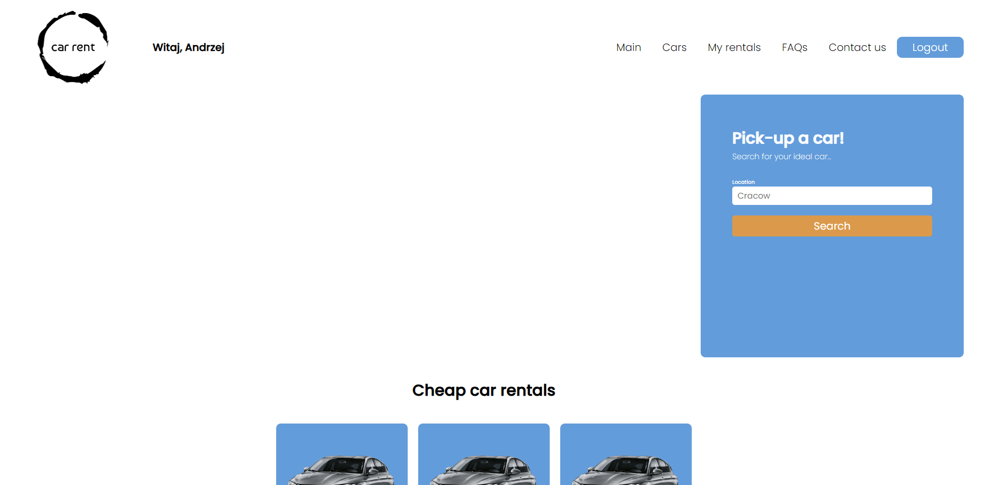
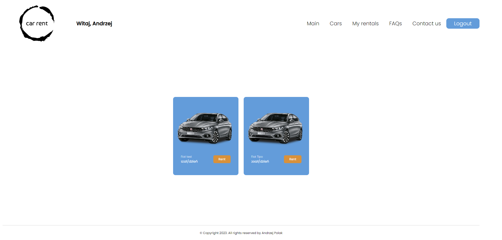
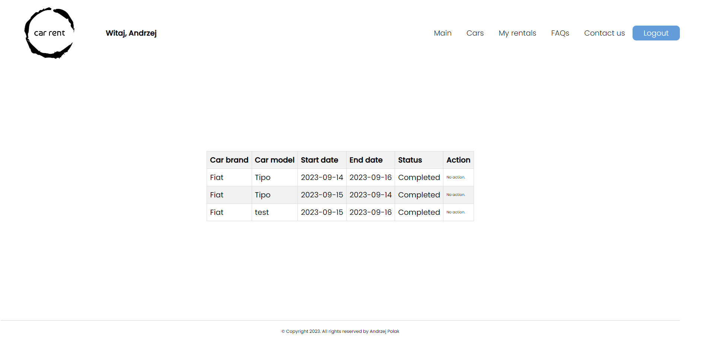
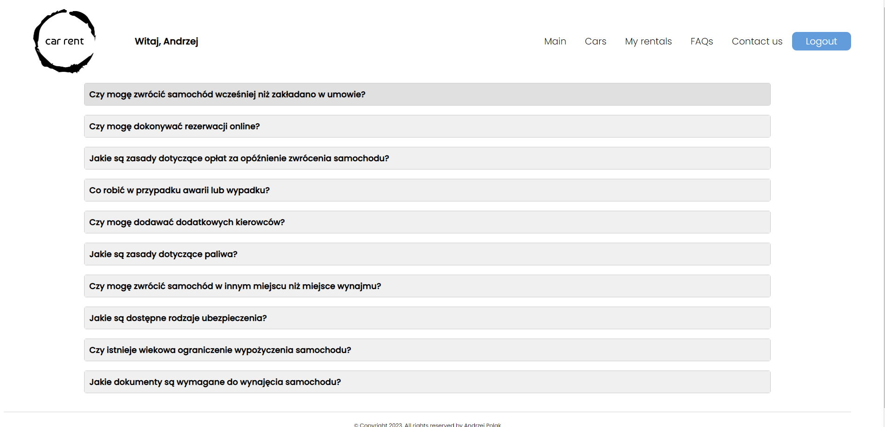
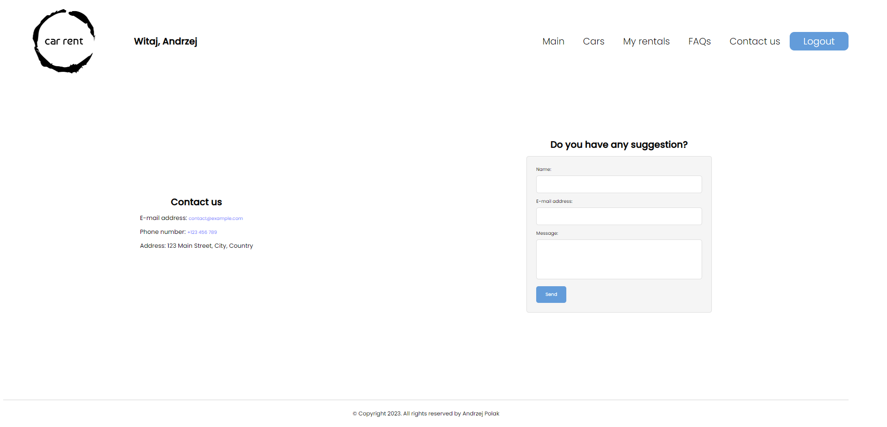
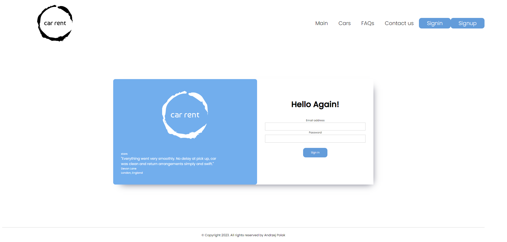
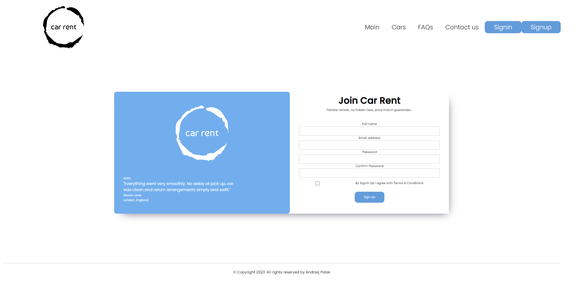
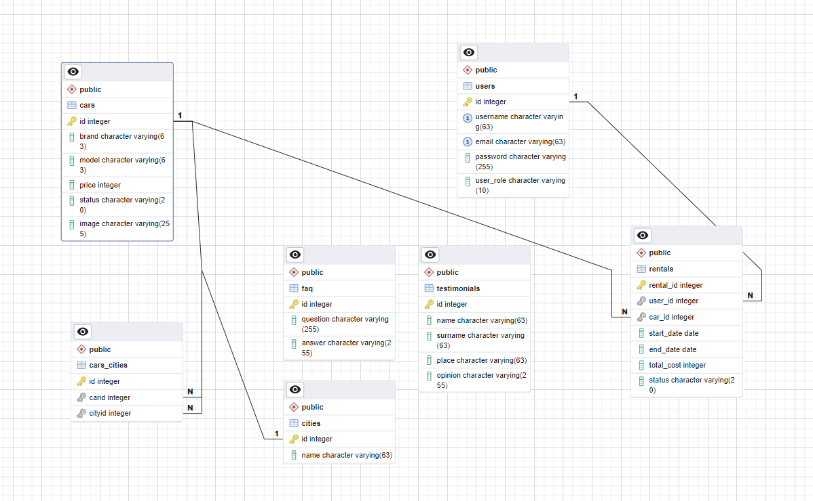

# CarRent

This is a web application project built with PHP that allows users to rent cars. It is possible to create an admin account who can add new cars, delete them, and edit existing users.

It utilizes:
-PHP
-JavaScript
-HTML
-CSS
-PostgreSQL
-Docker
-MVC Architecture

## Features

- Authentication: Users can create new accounts and gain access to the various functionalities offered by the platform.

- User Profiles: Each user has a personal profile that displays their name and rented cars.

### Applicaton Views

**Home Page**


**Cars Page**


**My Rentals**


**FAQs**


**Contact Page**


**Login**


**Register**


## Database

The project utilizes a PostgreSQL database. The repository contains two files:

- db.dump.sql - contains a database dump.
- database.sql - contains the necessary SQL code to create the database.

**ERD Diagram**


## UML

**Models**

**Controllers**

**Repositories**

**Database and Routing**

## Installation

To run this project locally, follow these steps:

1. Clone the repository.
2. Change to the project directory.
3. Create config.php file in root directory.
4. In config.php add following fileds and enter data for your database:

- const HOST = 'database-host';
- const PORT = 'database-port';
- const DATABASE = 'database-name';
- const USERNAME = 'postgres';
- const PASSWORD = 'somepassword';

5. In root directory you can find database dump - db.dump.sql.
6. Restore database.
7. Ensure that Docker is installed on your local machine.
8. Build docker image.

```
docker-compose build
```

9. Start the local development server.

```
docker-compose up
```

10. Turn off the local dev server.

```
docker-compose stop
```

## Usage

1. Open your web browser and navigate to `http://localhost:8080`
